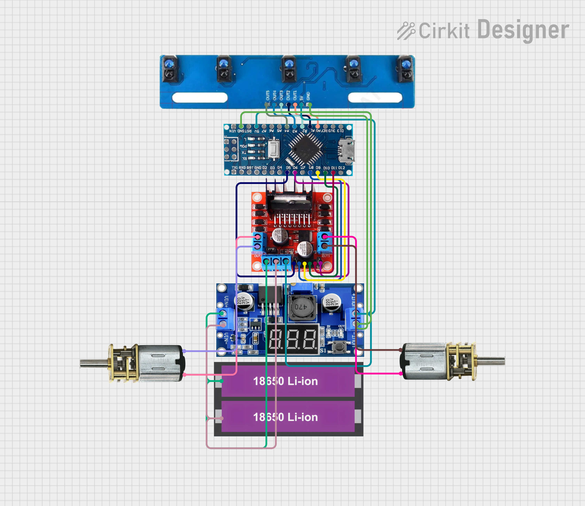
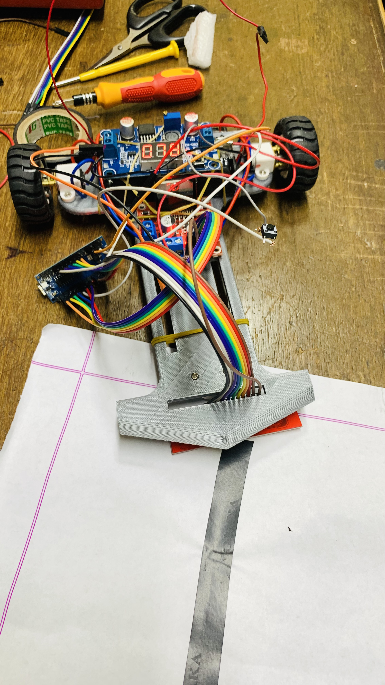
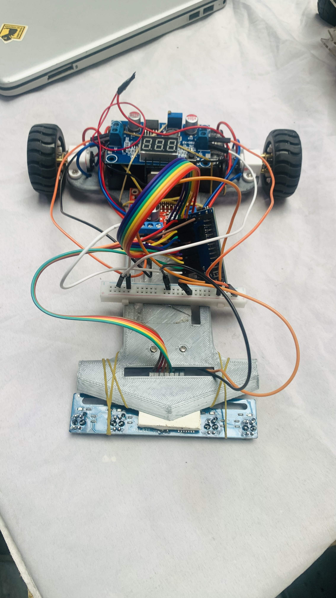

# Not-Following-Robot

PID-based line follower robot for smooth, stable, and accurate autonomous path tracking.

## Overview

This project is a 5-sensor line follower robot built around an Arduino-compatible controller and a dual H-bridge motor driver. The sketch reads a sensor array, computes line position error using weighted sensor values, and applies a PID controller to keep the robot centered on the track.

The current build uses:

- 5 IR line sensors
- 2 DC geared motors
- A motor driver module
- An Arduino Nano-style board
- A battery power supply

## How It Works

1. The 5 line sensors detect the contrast between the track and the background.
2. The sketch computes a weighted error from the active sensors.
3. A PID controller converts that error into a steering correction.
4. Motor speed is adjusted around a base speed so the robot turns smoothly instead of oscillating aggressively.
5. The loop runs at a fixed 50 ms sampling interval for consistent control.

At startup, the robot waits 5 seconds before beginning control, which gives time to place it on the track.

## Pin Configuration

### Motor Driver

| Arduino Pin | Signal | Purpose |
| --- | --- | --- |
| D5 | ENA | PWM speed control for the left motor |
| D8 | IN1 | Left motor direction |
| D9 | IN2 | Left motor direction |
| D6 | ENB | PWM speed control for the right motor |
| D10 | IN3 | Right motor direction |
| D11 | IN4 | Right motor direction |

### Line Sensors

| Arduino Pin | Signal | Position |
| --- | --- | --- |
| D2 | S1 | Rightmost sensor |
| D3 | S2 | Right-inner sensor |
| D4 | S3 | Center sensor |
| D12 | S4 | Left-inner sensor |
| D13 | S5 | Leftmost sensor |

## Control Tuning

The current tuning values in the sketch are:

- Base speed: 60
- Minimum speed: 0
- Maximum speed: 255
- Kp: 7
- Ki: 0.001
- Kd: 0.4
- Integral limit: 30
- Sampling rate: 50 ms

These values are a solid starting point, but the exact behavior depends on motor quality, battery voltage, sensor spacing, and track contrast.

## Wiring Diagram

The wiring layout used for this build is shown in:

- 

That diagram shows the sensor array, controller, motor driver, motors, and battery placement used in the current setup.

## Build Photos

The uploaded build photos are embedded below so they display directly in the README:






## Demo Video

The demo video is available here:

[Open the video on Google Drive](https://drive.google.com/file/d/1zlGPSLdt31QK9mADAdUIgmYkmwixvs34/view?usp=sharing)

## Diagrams and Other Images

[Open the folder on Google Drive](https://drive.google.com/file/d/13ASP1N0sicO0bpSCstyvRTlUjSiueaMS/view?usp=drive_link)

## Project Structure

```text
README.md
Not_following_robot_1/
	Not_following_robot_1.ino
extr/
	circuit_image.png
	IMG_0965.png
	IMG_1003.png
	lfr_track.mp4
```

## Sketch Notes

The line tracking logic is centered in the following parts of the sketch:

- `getError()` computes the weighted sensor position.
- `PID()` calculates correction from proportional, integral, and derivative terms.
- `loop()` applies the correction to motor speeds.
- `moveForward()` drives both motors forward with PWM control.

The sensor weights in the code are asymmetric by design, ranging from -7 on the far left to +7 on the far right. This gives the controller a simple representation of how far the robot has drifted from the line.


## Summary

This robot is designed to follow a line using real-time sensor feedback and PID control. The provided circuit diagram and photos document the current build, while the sketch provides a straightforward starting point for tuning and expansion.
